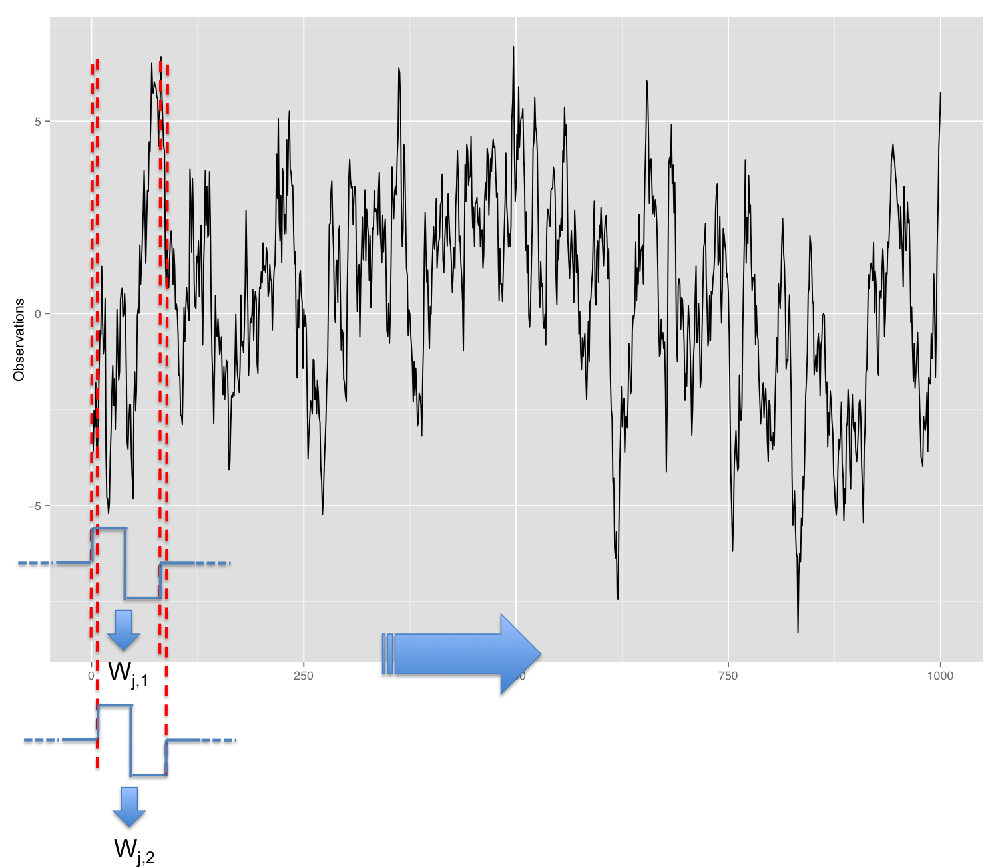

# The Generalized Method of Wavelet Moments

- A new framework for inertial sensor calibration.
- It is based on the Generalized Method of Wavelet Moments (GMWM) of @guerrier2013wavelet, which is a new statistical approach to estimate the parameters of (complex) time series models.
- The GMWM is able to estimate efficiently time series models which are commonly used to describe the errors of inertial sensors.
- This calibration approach provides considerable improvements (in terms of navigation performance) compared to existing methods.
- This methodology is robust (potentially applicable for FDI purposes) and is able to automatically select a suitable model (or rank models).

## The Wavelet Variance

The GMWM estimator is a GMM type estimator based on a quantity called the Wavelet Variance (WV). This quantity is computed by taking the variance of the Wavelet Coefficient wich are defined as

```{definition, defWC, name = "Wavelet Coefficient"}

In a similar way to the AV, we can define the Wavelet Variance (WV) at dyadic scales ($\tau_j$) for $j  \in \left\{x \in \mathbb{N} \, : \;  1 \leq x < \log_2 (T) - 1 \right\}$. To do so, we first need to define the wavelet filters $h_{j,l}$ as ``weights'' having the following properties
    \begin{equation*}
     \sum_{l=0}^{L_j-1} h_{j,l}=0, \,\, \sum_{l=0}^{L_1-1} h_{1,l}^2 =\frac{1}{2} \, \mathrm{and } \, \sum_{l=-\infty}^{\infty} h_{1,l}  h_{1,l+2m} = 0 ,
    \label{def:wvfilter}
\end{equation*}
where $m \in \mathbb{N}^+$, $L_j = (2^j-1)(L_1-1)+1$ is the length of the filter at level $j$ and $L_1$ is the length of the first level filter $h_{1,l}$.\\[0.2cm]

Then, the wavelet coefficients $W_{j,t}$ are defined as

\begin{equation*}
    W_{j,t} = \sum_{l=0}^{L_j-1}h_{j,l} X_{t-l}.
\end{equation*}

```


There exist many type of Wavelet Filter. In this book, we will focus on the Maximum Overlap Discrete Wavelet Transform (MODWT), which is the most usefull one. 

```{r, fig.height = 5, fig.width = 6.5, cache = TRUE, fig.align='center', out.width='80%', fig.cap='MODWT Wavelet Coefficient', echo=FALSE}

```

The wavelet filters give non-zero weights to observations at a given lag (window sizes of length $L_j$). Hence, there are as many WV as there are scales, and can be computed on consecutive windows, or on overlapping windows (to get ${W}_{j,t}$ using ${h_j}$). Overlapping windows lead to more efficient estimators (such as the MODWT).

Based on the previously computed Wavelet Coefficients $$W_{j,t}$$, we want to compute the WV for each scale, which is defined as: 

```{definition, defWV, name = "Wavelet Variance"}
The WV of the Wavelet Coefficient $W_{j,t}$, is the variance of the Wavelet Coefficients at level $j$
  
\begin{equation*}
	 \nu_{j}^2 \equiv \text{Var}[W_{j,t}].
\end{equation*}

```

```{lemma, lemmavtowv, name = "Relation between WV and AV"}
One of the propreties of the WV, is its exact relationship to the AV. Indeed, when using the Haar wavelet filter, $h_{j,l}$, $$ \nu_{j}^2 = 2 \text{AVar}_j$$. The proof of this proprety is given in @percival1994long.
```

Based on Lemma \@ref(lem:lemmavtowv), it is possible to compute the theoretical WV based on their AV counterpart. 

```{example, label = wvtheoar1, name = "Theoretical WV of an AR(1) process"}
\begin{equation*}
						Y_t = \phi Y_{t-1} + \varepsilon_t, \;\; \varepsilon_t \overset{iid}{\sim}  \mathcal{N}\left( 0 , \sigma^2 \right), \;\;  t = 1, ... , T
\end{equation*}

With $\tau_j = 2^j$, the theoretical (Haar) WV of such process is given by
\begin{equation*}
		  \nu_{j} =\frac{\left( \frac{\tau_j}{2} - 3 \phi - \frac{\tau_j \phi^2}{2} + 4\phi^{\frac{\tau_j}{2} + 1} - \phi^{\tau_j + 1} \right) \sigma^2}{\frac{\tau_j^2}{2} \left(1 - \phi \right)^2 \left(1 - \phi^2 \right)}.
\end{equation*}
```

Based on the analytical formula in Example \@ref(wvtheoar1), we can plot the theoretical WV of a AR1 process for various values of the parameter $\phi$, which is illustrated in fig.  

```{r, fig.height = 5, fig.width = 6.5, cache = TRUE, fig.align='center', out.width='80%', fig.cap='Theoretical WV for AR1 processes .', echo=FALSE}
knitr::include_graphics("images/AR1WVtheo.pdf")
```

```{definition, defWVest, name = "Wavelet Variance Estimator"}
	An unbiased estimator for the WV issued from a certain wavelet transform is given by the \textbf{MODWT estimator} (see \cite{percival1995estimation})
	%
	\begin{equation*}
	\hat{\nu}_{j}^2 = \frac{1}{M_j(T)} \sum_{t=L_j}^{T} {W}_{j,t}^2
	 \end{equation*}
	%
	where $M_j(T) = T - L_j + 1$.	

```

There exist other estimators of the WV, in particular robust estimators that perform well when the observed time series suffers from the presence of outliers or other forms of contamination. However, when the observed time series is uncontaminated, $\hat{\nu}_{j}^2$ is the most statistically efficient.


```{lemma, lemmWVconcist, name = "Consistency of WV estimator"}
 Let $(X_t)$ be such that:
    \begin{itemize}
        \item $(X_t - X_{t-1})$ is a (strongly) stationary process,
        \item $(X_t - X_{t-1})^2$ has absolutely summable covariance structure,
        \item $\mathbb{E}\left[(X_t - X_{t-1})^4 \right] < \infty$ for some $\delta > 0$.
    \end{itemize}
    Defining $\hat{\boldsymbol{\nu}} \equiv [\hat{\nu}_{j}^2]_{j = 1, \dots, J}$, with $J$ being a bounded quantity, then we have $$\hat{\boldsymbol{\nu}} \overset{ \mathcal{P} }{\longrightarrow} \boldsymbol{\nu} \,.$$
    
```


```{proof, proofWVconsist, name = "Proof of WV consistency"}
The proof of the element-wise consistency is direct from Theorem \ref{thm:wlln:dep}. Let $Z_t = X_t - X_{t-1}$, then since $Z_t$ is stationary with mean zero then so is $(X_t - X_{t-h})$ for all $h \in \mathbb{Z}$. This directly imply that for all $j = 1, \dots, J$, $(W_{j,t})$ is also stationary (since it based on a linear combination of stationary processes) and so is $Y_t = W_{j,t}^2$ (since it is based on a time invariant transformation of a stationary process). Moreover, there exist constant $c_h$ such that

\begin{equation*}
    \sum_{h = -\infty}^{\infty} \; \gamma_Y (h) = \sum_{h = -\infty}^{\infty} \; c_{|h|} \gamma_{Z^2} (h).
\end{equation*}

Therefore, we obtain

\begin{equation*}
    \sum_{h = -\infty}^{\infty} \; |\gamma_Y (h)| = \sum_{h = -\infty}^{\infty} \; |c_{|h|} \gamma_{Z^2} (h)| \leq \sup_{k = 1, ..., \infty} c_k \; \sum_{h = -\infty}^{\infty} \; |\gamma_{Z^2} (h)| < \infty,
\end{equation*}

since both terms are bounded. Using the same approach we have that $\mathbb{E}\left[Y_t^2\right]$ is bounded since $\mathbb{E}\left[Z_t^4\right]$ bounded. Thus, we can apply Theorem \ref{thm:wlln:dep} on the process $Y_t$, i.e.

\begin{equation*}
    \hat{\nu}^2_j = \frac{1}{M_j(T)} \sum_{t=L_j}^{T} {W}_{j,t}^2\overset{ \mathcal{P} }{\longrightarrow}  \nu^2_j.
\end{equation*}

\end{frame}

\begin{frame}{Proof of Lemma \ref{lemm:consistencyWV}}
\footnotesize
Since
$$\hat{\nu}^2_j \overset{ \mathcal{P} }{\longrightarrow} \nu^2_j \, ,$$
and given that $J$ is a bounded quantity, we have that

\begin{eqnarray*}
    \|\hat{\boldsymbol{\nu}} - \boldsymbol{\nu}\|_2 &=& \sum_{j=1}^J (\hat{\nu}^2_j - \nu^2_j)^2\\
    &<& J \,\, \underset{j}{\text{max}}\, ((\hat{\nu}^2_j - \nu^2_j)^2) \, .
\end{eqnarray*}

Based on the element-wise consistency, we have that

\begin{equation*}
    J \,\, \underset{j}{\text{max}}\, ((\hat{\nu}^2_j - \nu^2_j)^2) \overset{ \mathcal{P} }{\longrightarrow} 0,
\end{equation*}

and hence

\begin{equation*}
    \|\hat{\boldsymbol{\nu}} - \boldsymbol{\nu}\|_2 \overset{ \mathcal{P} }{\longrightarrow} 0 \, .
\end{equation*}

which concludes the proof.\hfill $\blacksquare$
```

Compare to consistency, asymptotic normality requires stronger conditions given in the following lemma. $J$ is also bounded.

```{lemma, lemmWVasynorm, name = "Asymptotic Normality of WV estimator"}
Let $(X_t)$ be such that:

- $(X_t - X_{t-1})$ is a (strongly) stationary process,
- $(X_t - X_{t-1})$ is a strong mixing process with mixing coefficient $\alpha(n)$ such that $\sum_{n=1}^{\infty} \alpha(n)^{\frac{\delta}{2+\delta}} < \infty$ for some $\delta > 0$,
- $\mathbb{E}\left[(X_t - X_{t-1})^{4+2\delta}\right] < \infty$ for some $\delta > 0$.

    Then we have, $$\sqrt{T}   \left(\hat{\boldsymbol{\nu}} - \boldsymbol{\nu} \right) \overset{ \mathcal{D} }{\longrightarrow} \mathcal{N}(\mathbf{0},\boldsymbol{\Sigma}),$$ where $\boldsymbol{\Sigma}$ is the asymptotic covariance matrix of $\hat{\boldsymbol{\nu}}$ with elements $\sigma^2_{ij} \equiv \sum_{h = -\infty}^{\infty}\text{cov}\left(W_{i,0}W_{j,0}, W_{i,h}W_{j,h} \right)$.
```

```{proof, proofWVasynorm, name = "Proof Asymptotic Normality of WV estimator"}
TO DO
```
    
Based on the asymptotic normality results (Lemma \ref{lemma:asy:WV}), we can construct the $(1-\alpha)$-confidence intervals for $\hat{\nu}_j$ as
%
\begin{equation*}
    \text{CI}\left(\nu_j, \alpha \right) = \left[ \hat{\nu}_j \pm z_{1- \frac{\alpha}{2}} \frac{\sigma_{jj}}{T} \right],
\end{equation*}
%
where $z_{1- \frac{\alpha}{2}} \equiv \boldsymbol{\Phi}^{-1}\left( 1- \frac{\alpha}{2} \right)$ is the $(1- \frac{\alpha}{2})$ quantile of a standard normal distribution.\\
However, the Long-Run Variance $\sigma_{jj}$ is usually known. Many methods has been proposed to consistently estimate under mild conditions (see e.g. \cite{newey1986simple}).\\

However, for finite $T$, CI based on the asymptotic normality would be problematic, because the lower limit of CI can be negative. Alternatively, to avoid this problem, we can use following asymptotic result
%
\begin{equation*}
    \eta \frac{\hat{\nu}_j}{\nu_j} \overset{ \mathcal{D} }{\longrightarrow} \chi^2_{\eta},
\end{equation*}
%
where $\eta$ is a constant which can be estimated by $\max\left\{\frac{M_j}{2^j}, 1\right\}$. Moreover, this method can also avoid the estimation of Long-Run Variance $\sigma_{jj}$.
Then the confidence interval is 
%
\begin{equation*}
    \text{CI}\left(\nu_j, \alpha\right) = \left[ \frac{\eta\hat{\nu}_j}{F^{-1}_{\chi^2_{\eta}}(\alpha/2)}, \; \frac{\eta\hat{\nu}_j}{F^{-1}_{\chi^2_{\eta}}(1-\alpha/2)} \right].
\end{equation*}


```{r exampleWVwhitenoise, fig.height = 5, fig.width = 6.5, cache = TRUE, fig.align='center', fig.cap='ADD A NICE CAPTION', warning=F}
# Load packages
library(wv)      # Package for Wavelet Variance functions
library(simts)   # Package for time series simulations

# Simulate white noise
Xt = gen_gts(WN(sigma2 = 1), n = 10^5)

# Compute the WV
wv_xt = wvar(Xt)

# WV log-log representation
plot(wv_xt)

```

## The GMWM

To recover the parameter vector $\boldsymbol{\theta}$ that from the specified model $F_{\boldsymbol{\theta}}$, we want to exploit the unique relationship between the theoretical WV and the vector $\boldsymbol{\theta}$.


In a similar way to the method based on the AV, the idea would be to find the model parameter values implied by the observed WV, i.e.

\begin{equation*}
    \hat{\boldsymbol{\theta}} = \boldsymbol{\theta}(\hat{\boldsymbol{\nu}}) ,
\end{equation*}

where $\boldsymbol{\theta}(\boldsymbol{\nu})$ is the inverse of the function $\boldsymbol{\nu}(\boldsymbol{\theta})$.

```{definition, defgmwm, name = "Generalized Method of Wavelet Moments (GMWM)"}
The GMWM estimator is obtained as follows
\begin{equation*}
        \hat{\boldsymbol{\theta}} = \underset{\boldsymbol{\theta} \in \boldsymbol{\Theta}}{\text{argmin}} \, (\hat{\boldsymbol{\nu}} - \boldsymbol{\nu}(\boldsymbol{\theta}))^T\boldsymbol{\Omega}(\hat{\boldsymbol{\nu}} - \boldsymbol{\nu}(\boldsymbol{\theta})),
\end{equation*}

where $\boldsymbol{\nu}(\boldsymbol{\theta})$ is the theoretical WV implied by a model with parameter vector $\boldsymbol{\theta}$ and $\boldsymbol{\Omega}$ is a positive-definite weighting matrix.
```

### Choice of weighting matrix

### Consistency

