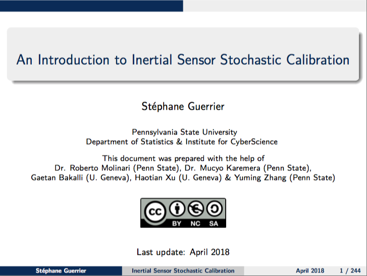

*Travis:* 

# Overview 

:warning: This book is currently under development and has been designed as an introductory course on Inertial Sensor Stochastic Calibration. This document is based on the presentation below, which was used in a short course given at the University of Calgary in 2018. The source files are available in the `Slides` folder.

